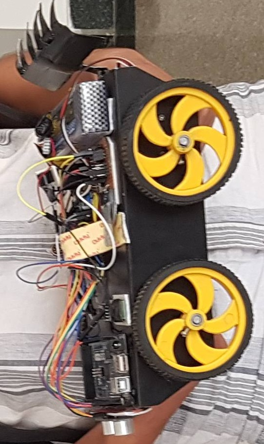

# Autonomous-Plough

Autonomous-Plough is a bot created for Himalaya Exhibition (HEx) 2018. It was able to plough a given area and response to the obstacles during this process.

## Images

   

## Components Used

1. Arduino Uno
1. Ultrasonic Sensor HC-SR04
1. Motor Driver L298N
1. BO motor *4
1. Servo Motor
1. LiPo battery
1. Buzzer

## Working

This bot can be operated manually or autonomously. In manual mode all the commands are given via serial communication (Bluetooth in this case). Once autonomous mode is activated, the bot will divide the given length in to equal segments wher each segment is equal to double the width of the plough. It will then plough the segment and respond to the obstacles. This will continue until the entire area is ploughed.